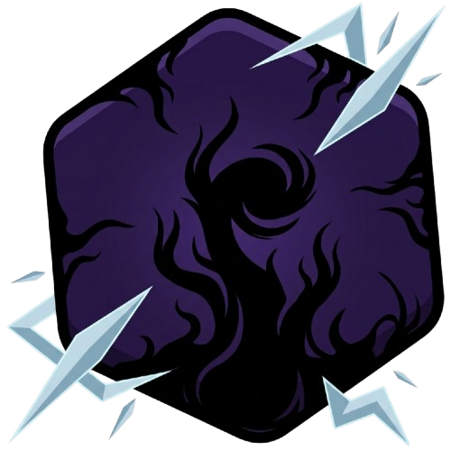

<div align="center">



# Wardstone · CoreProtect

**El plugin-núcleo de la red de Minecraft [MoonlightMC](https://moonlightmc.xyz)**

Núcleos de protección · KOTH & Champions · 23 minijuegos · kits · misiones · economía · voicechat por proximidad

<br/>


</div>

---

> [!IMPORTANT]
> Este repositorio es **source-available solo para consulta y auditoría**. **No es open source.**
> Su ejecución, despliegue, redistribución o modificación fuera de la red oficial **MoonlightMC**
> está prohibida. Lee [`LICENSE`](LICENSE) antes de nada.

## ¿Qué es?

**Wardstone** (paquete interno `CoreProtect`) es el plugin monolítico que sostiene la experiencia
de MoonlightMC: más de **260 clases** y **~114.000 líneas** de Java sobre Paper 1.21.11, con **55 comandos**
y decenas de sistemas propios trabajando juntos.

## ✨ Sistemas

| Área | Qué incluye |
|------|-------------|
| 🛡️ **Núcleos de protección** | 20 niveles de núcleo, áreas configurables, animaciones de partículas y **EvoCore** (dashboard web de equilibrio dinámico + embebido de BlueMap) |
| 👑 **KOTH & Champions** | King of the Hill, Ojo de la Tormenta, agujero negro y el modo Champions |
| 🎮 **23 minijuegos** | Murder Mystery, Build Battle, TNT Run/Tag, Spleef, Sumo, OITC, Parkour Race, Musical Chairs, Red Light/Green Light, Pillars of Fortune, Floor is Lava, Farm Hunt, Beast Escape… |
| ⚔️ **Combate & kits** | Kits, finishers, combos, killstreaks y ajustes de PvP |
| 🌑 **Misiones — El Errante** | Línea narrativa de misiones (`shadowhunter`) con jefes, restricciones y progresión |
| 💰 **Economía & progreso** | Subastas, trading seguro, recompensas (bounties), prestigio, esencia, vaults y rachas |
| 🐉 **Boss Arena** | Arena de jefes con eventos |
| 🎙️ **Voicechat por proximidad** | Integración con voz posicional vía token |
| 🤖 **Discord** | Bot de verificación y comandos puente |
| 🔌 **Integraciones** | Vault (dep.), BlueMap · PlaceholderAPI · LibsDisguises (opcionales) |
| 🧩 **Calidad de vida** | Logros, warps, spawn, dormir en grupo, zona AFK, nametags, tips y más |

## 🛠️ Stack

- **Plataforma:** Paper `1.21.11-R0.1-SNAPSHOT`
- **Lenguaje:** Java 21
- **Build:** Maven + `maven-shade-plugin`
- **Dependencia obligatoria:** Vault · **Opcionales:** BlueMap, PlaceholderAPI, LibsDisguises

## 🔧 Compilar

```bash
mvn -q clean package
```

El JAR sombreado queda en `target/`.

## ⚙️ Configuración

`src/main/resources/config.yml` se publica con **valores de ejemplo**. Los secretos reales
**nunca** se versionan aquí y hay que rellenarlos antes de desplegar:

| Placeholder | Dónde |
|-------------|-------|
| `YOUR_BOT_TOKEN_HERE` | `config.yml` → `discord.bot-token` |
| `REPLACE_WITH_VOICECHAT_SECRET` | secreto del API de voicechat (en código) |
| `REPLACE_WITH_PUBLIC_IP` | IP pública del servidor de voicechat |
| `YOUR_GEMINI_API_KEY_HERE` | API key de Gemini (minijuego *YesNo*) |

## 📂 Estructura

```
src/main/java/com/moonlight/coreprotect/
├── protection/  core/  evocore/     # núcleos y protección
├── koth/  bossarena/                # eventos competitivos
├── minigames/  minigames/games/     # 23 minijuegos
├── kits/  combat/  combos/  pvp/    # combate
├── shadowhunter/                    # misiones (El Errante)
├── auction/  trading/  vault/  …    # economía
├── discord/  voicechat/             # integraciones externas
└── util/  gui/  listeners/  …       # soporte
src/main/resources/  → plugin.yml · config.yml · messages.yml
```

## 📜 Licencia

Propietaria — **todos los derechos reservados**. Uso exclusivo en MoonlightMC.
Consulta [`LICENSE`](LICENSE) para los términos completos.

<div align="center">
<sub>Hecho para <b>MoonlightMC</b> · <a href="https://moonlightmc.xyz">moonlightmc.xyz</a></sub>
</div>
